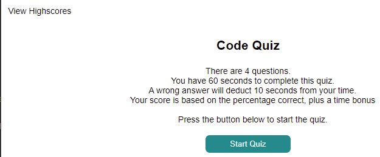
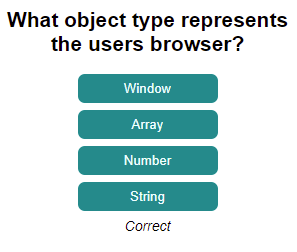
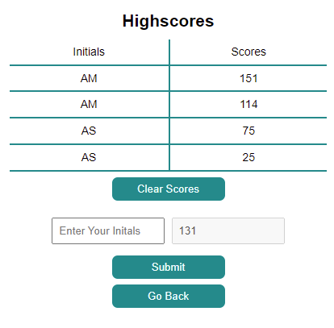

# Bootcamp Week 4 - Code Quiz

## Project Details

For week 4 our task was to design and develop a code quiz application given the following User Story

You can find a deployed version of this application here - https://minusinfinite.github.io/js-coding-quiz/

> AS A coding boot camp student
>
> I WANT to take a timed quiz on JavaScript fundamentals that stores high scores
>
> SO THAT I can gauge my progress compared to my peers

There was no starting point provided for this assignement only a GIF demo of how the applicaiton was intended to work.

## Acceptance Criteria and Development Process

This task had a GIF demo of the applications flow but as the follow criteria shows how to bulk of the logic worked was upto the student.

> GIVEN I am taking a code quiz
>
> WHEN I click the start button
>
> THEN a timer starts and I am presented with a question

This took sometime to visualise on how the Questions and Answers would be generated.

From the classes this week it was best to have an Object for storing this data. As such the following Object was defined

```javascript
var quiz = {
    questions: [
        "What object type represents the users browser?",
        "Which symbols defind an object?",
        "__ is the start of a Conditional Statement",
        "what does parseInt() return",
    ],
    options: [
        ["Window", "Array", "Number", "String"],
        [
            "Squre brackets",
            "Curly brackets",
            "Rounded Brackets",
            "Quotation Marks",
        ],
        ["Boolean", "Function", "If", "DOM"],
        ["Object", "Number", "Array", "JSON"],
    ],
    answers: ["Window", "Curly brackets", "If", "Number"],
    current: 0,
    answered: 0,
    incorrect: 0,
    timeRemaining: 0,
    total: function () {
        return this.questions.length
    },
    score: function () {
        if (this.answered === 0) {
            this.incorrect = this.total()
        }
        return (
            ((this.total() - this.incorrect) / this.total()) * 100 +
            this.timeRemaining
        )
    },
}
```

With the `quiz` object created I used some basic setInterval/clearInterval functions for the Timer.

```javascript
function startTimer(seconds) {
    timeLeft = seconds

    timerId = setInterval(function () {
        if (timeLeft === 0) {
            clearInterval(timerId)
            timeEl.textContent = ""
            scoreForm()
        } else {
            timeEl.textContent = `Time: ${
                timeLeft < 10 ? `0${timeLeft}` : `${timeLeft}`
            }`
            timeLeft--
        }
    }, 1000)
}

function stopTimer() {
    clearInterval(timerId)
    quiz.timeRemaining = timeLeft
    timeLeft = 0
    timeEl.textContent = ""
}
```

The Start button is not defined in HTML itself but is generated when the `init()` function is called. With the assistance of using Template Latierals and setting the CSS white-space to `pre` is came out quite nice



```javascript
function init() {
    if (quizEl.getAttribute("class") === "hidden") {
        quizEl.removeAttribute("class")
    }
    quizEl.textContent = ""
    quiz.answered = 0
    quiz.current = 0
    quiz.incorrect = 0

    var initQuizH1 = document.createElement("h1")
    initQuizH1.textContent = "Code Quiz"

    var initQuizP = document.createElement("p")
    initQuizP.textContent = `There are ${quiz.total()} questions.
    You have ${quiz.total() * 15} seconds to complete this quiz.
    A wrong answer will deduct 10 seconds from your time.
    Your score is based on the percentage correct, plus a time bonus

    Press the button below to start the quiz.`

    var initQuizBtn = document.createElement("button")
    initQuizBtn.setAttribute("id", "start")
    initQuizBtn.textContent = "Start Quiz"

    quizEl.appendChild(initQuizH1)
    quizEl.appendChild(initQuizP)
    quizEl.appendChild(initQuizBtn)

    startBtn = document.querySelector("#start")

    startBtn.addEventListener("click", (_event) => {
        _event.preventDefault()
        startTimer(quiz.total() * 15)
        getQuestion(quiz.current)
    })
}

init()
```

> WHEN I answer a question
>
> THEN I am presented with another question

Once we click our start button the `getQuestion()` function is triggered.
This takes an index argument generally this would be only the object property `quiz.current` but this function would likely be useful to refactor if needed.

```javascript
function getQuestion(index) {
    var quizQuestion = document.createElement("h1")
    quizEl.textContent = ""

    if (!quiz.questions[index]) {
        stopTimer()
        scoreForm()
    } else {
        quizQuestion.textContent = quiz.questions[index]
        quizEl.appendChild(quizQuestion)

        /*
        This for loop creates the buttons needed for the answers.
        This does mean it is possible to cheat if the source code is looked at
        */
        for (var i = 0; i < quiz.options[index].length; i++) {
            var quizBtn = document.createElement("button")
            var options = quiz.options[index][i]
            var answer = quiz.answers[index]
            quizBtn.setAttribute("data-index", i)
            if (options === answer) {
                quizBtn.setAttribute("data-answer", "yes")
            } else {
                quizBtn.setAttribute("data-answer", "no")
            }
            quizBtn.textContent = options
            quizEl.appendChild(quizBtn)
        }
    }
}
```

This also allowed me to find that for every run of a `for` loop you can create unique HTML Element DOMStrings that would not be overwritten. This came in hand when setting up the Scoreboard later.
Unfortunately, the method used to confirm the answer does make it trivial to cheat of the source of the HTML is reviewed.

> WHEN I answer a question incorrectly
>
> THEN time is subtracted from the clock

The following Event Listener is added to the container DIV Element to capture if a button is being clicked. This updates the `quiz` object that the player has clicked answered a question and the current question index.

Checking that buttons `data-*` attribute to confirm the answer and trigger a function that will display the result before triggering the next questions.

```javascript
quizEl.addEventListener("click", function (event) {
    var element = event.target

    //This checks to confirm that is was an answer button that triggered.
    if (element.localName === "button" && element.hasAttribute("data-answer")) {
        quiz.current++
        quiz.answered++
        var answer = element.getAttribute("data-answer")
        if (answer === "yes") {
            stateAnswer("Correct")
        } else if (answer === "no") {
            quiz.incorrect++
            timeLeft -= 10
            stateAnswer("wrong")
        }
    }
})
```

Originally this was one function. But I found some odd behaviour when `init()` was triggered after the quiz was completed and it would sometimes retrigger the above event check, as such refactoring it into it's own call resolved that issue.

```javascript
function stateAnswer(answer) {
    var isCorrect = document.createElement("em")
    var displayTimer
    var count = 3
    isCorrect.textContent = ""
    quizEl.appendChild(isCorrect)

    displayTimer = setInterval(function () {
        if (count === 0) {
            clearInterval(displayTimer)
            quizEl.lastChild.remove()
            getQuestion(quiz.current)
        } else {
            isCorrect.textContent = answer
            count--
        }
    }, 300)
}
```



> WHEN all questions are answered or the timer reaches 0
>
> THEN the game is over
>
> WHEN the game is over
>
> THEN I can save my initials and my score

The scoreboard below is generated when all questions are completed or the timer expires.
The HTML for the form is accually already there, while possible to generate programatically this proved to be very tedious and made it more channeling to select and update the needed Elements.



As such the DIV is set to `display: none;` initially and this removed when needed.
Given how often this changes it may be possible to refactor it into it's own function.

The form and the scoreboard are split into two functions through. So it is possible to click "View Highscores" without the form and only show the form when the quiz is complete.

The table is created using SPAN elments and generates depending on length of the scores saved into localStorage, if any.

```javascript
function scoreTable() {
    var scoreEl = document.querySelector("#scoreboard")
    var scoreSpanHeader1 = document.createElement("span")
    var scoreSpanHeader2 = document.createElement("span")
    var hiscores = [...JSON.parse(storedScores)].sort(
        (a, b) => b.score - a.score
    )

    quizEl.setAttribute("class", "hidden")
    if (highscoresEl.getAttribute("class") === "hidden") {
        highscoresEl.removeAttribute("class")
        highscoresBtn.setAttribute("class", "hidden")
    }

    scoreEl.setAttribute("class", "scores")
    scoreEl.textContent = ""
    scoreSpanHeader1.textContent = "Initials"
    scoreSpanHeader2.textContent = "Scores"
    scoreEl.appendChild(scoreSpanHeader1)
    scoreEl.appendChild(scoreSpanHeader2)
    if (hiscores.length > 0) {
        for (var i = 0; i < hiscores.length; i++) {
            for (var prop in hiscores[i]) {
                var scoreSpan = document.createElement("span")
                scoreSpan.textContent = hiscores[i][prop]
                scoreEl.appendChild(scoreSpan)
            }
        }
    }

    clearBtn.removeAttribute("class")

    clearBtn.addEventListener("click", () => {
        localStorage.clear()
        storedScores = "[]"
        scoreTable()
    })

    backBtn.addEventListener("click", () => {
        highscoresEl.setAttribute("class", "hidden")
        highscoresBtn.removeAttribute("class")
        init()
    })
}
```

Form will call the Table function so that any newly added score can be added to it and sorted.
This is then stored into a localeStore string to be restored on revist.

```javascript
function scoreForm() {
    var initialInput = document.querySelector("#initials")
    var scoreInput = document.querySelector("#score")
    var scoreSubmit = document.querySelector("#submit")
    var playerScore = 0

    //The Score is added as a percentage of correct answers plus a bonus for speed
    playerScore = quiz.score()

    var result = {
        initials: "",
        score: 0,
    }

    scoreTable()
    quizEl.setAttribute("class", "hidden")
    if (formEl.getAttribute("class") === "hidden") {
        formEl.removeAttribute("class")
        initialInput.removeAttribute("class")
        initialInput.removeAttribute("placeholder")
        highscoresBtn.setAttribute("class", "hidden")
    }

    initialInput.value = ""
    scoreInput.value = playerScore
    scoreSubmit.addEventListener("click", (event) => {
        event.preventDefault()
        /* There is an unidentifed "bubble" here. Sometimes triggering this twice. 
        This appear to be the a likely prevention */
        event.stopImmediatePropagation()
        if (
            initialInput.value.trim() === "" ||
            initialInput.value.trim().length > 3
        ) {
            initialInput.setAttribute("class", "warning")
            initialInput.setAttribute("placeholder", "Invalid input")
        } else {
            result.initials = initialInput.value.trim()
            result.score = quiz.score() + timeLeft
            var hiscores = [...JSON.parse(storedScores), result]
            localStorage.setItem("highscore", JSON.stringify(hiscores))
            storedScores = localStorage.getItem("highscore")
            formEl.setAttribute("class", "hidden")

            initialInput.setAttribute("placeholder", "Invalid input")
            scoreTable()
        }
    })
}
```
